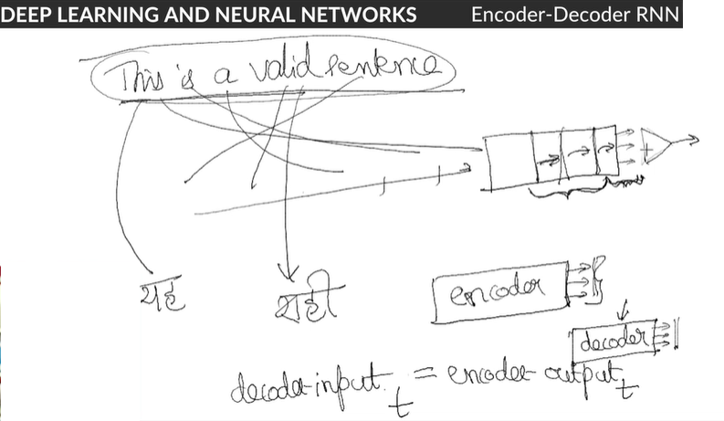

# Recurrent Neural Networks

## What Makes a Neural Network Recurrent?

### Introduction
In this module, you’ll learn **Recurrent Neural Networks** or **RNNs**. RNNs are specially designed to work with **sequential data**, i.e. data where there is a natural notion of a 'sequence' such as text (sequences of words, sentences etc.), videos (sequences of images), speech etc. RNNs have been able to produce state-of-the-art results in fields such as natural language processing, computer vision, and time series analysis.

One particular domain RNNs have revolutionised is **natural language processing**. RNNs have given, and continue to give, state-of-the-art results in areas such as machine translation, sentiment analysis, question answering systems, speech recognition, text summarization, text generation, conversational agents, handwriting analysis and numerous other areas. In computer vision, RNNs are being used in tandem with CNNs in applications such as image and video processing.

Many RNN-based applications have already penetrated consumer products. Take, for example, the **auto-reply** feature which you see in many chat applications, as shown below:

You may have noticed auto-generated subtitles on YouTube (and that it has surprisingly good accuracy). This is an example of **automatic speech recognition (ASR)** which is built using RNNs.

Similarly, when you talk to a support team of a food delivery app, or any other support team for that matter, you get an auto-reply in the initial stages of your interaction where the support team asks about details such as order date, problem description and other basic things. Many of these conversational systems, informally called '**chatbots**', are trained using RNNs.

RNNs are also being used in applications other than NLP. Recently, OpenAI, a non-profit artificial intelligence research company came really close to defeating the world champions of Dota 2, a popular and complex battle arena game. The game was played between a team of five bots (from OpenAI) and a team of five players (world champions). The bots were trained using reinforcement learning and recurrent neural networks.

There are various companies who are generating music using RNNs. [Jukedeck](https://www.jukedeck.com/about) is one such company.

There are many other problems which are yet to be solved, and RNNs look like a promising candidate to solve them. You could be the one to make an impact in those areas. With that in mind, let’s start the module.

### What are Sequences?
Just like CNNs were specially designed to process images, **Recurrent Neural Networks (RNNs)** are specially designed to process **sequential data**. 

In **sequential data**, entities occur in a particular order. If you break the order, you don’t have a meaningful sequence anymore. For example, you could have a sequence of words which makes up a document. If you jumble the words, you will end up having a nonsensical document. Similarly, you could have a sequence of images which makes up a video. If you shuffle the frames, you’ll end up having a different video. Likewise, you could have a piece of music which comprises of a sequence of notes. If you change the notes, you’ll mess up the melody.

Recurrent neural networks are variants of the vanilla neural networks which are tailored to learn sequential patterns. 

You saw some examples of sequence problems. Let’s now see an interesting unconventional example of a problem involving sequences which can be solved using RNNs.

Although sorting is a problem that involves an algorithm, but the fact that RNNs can learn an algorithm speaks volume about their capacity to solve hard learning problems.

### What Makes the Network Recurrent
You now know what sequences are. In this section, you’ll learn how a normal feedforward network is modified to work with sequences.

Let's quickly recall the feedforward equations of a normal neural network:

Let's now understand what makes this specialised neural network 'recurrent'.

These notations and ideas will be more clear going forward. Let's now look at the feedforward equations of an RNN in the following segment.

### Architecture of an RNN
Let's now look at how the architecture of an RNN visually and compare it to a normal feedforward network.

The following figure shows the RNN architecture along with the feedforward equations:

For example, let's say that layer-2 and layer-3 have 10 and 20 neurons respectively. Each of the red copies of the second layer will have 10 neurons, and likewise for layer-3.  

### Feeding Sequences to RNNs
In a previous segment, we had discussed sequences briefly. Let’s now take a look at how various types of sequences are fed to RNNs.

Now that you understand how an RNN consumes one sequence, let’s see how do you train a batch of such sequences.

You learnt how to feed data to an RNN. In the case of an RNN, each data point is a sequence.The individual sequences are assumed to be **independently and identically distributed (I.I.D.)**, though the entities within a sequence may have a dependence on each other.

You also saw how the data can be fed in **batches** just like any normal neural net - a batch here comprises of multiple data points (sequences).

### Comprehension: RNN Architecture
In a previous section, you studied the feedforward equations of RNNs. Let's now analyse the architecture in a bit more detail - we will compute the dimensions of the weight and bias matrices, the outputs of layers etc. We will also look at a concise form of writing the feedforward equations.

As you already know, the architecture of an RNN and its feedforward equations are as follows:

### RNNs: Simplified Notations
You may commonly come across a concise, simplified notation scheme for RNNs. Let's discuss that as well. The RNN feedforward equations are:

This form is not only more concise but also more computationally efficient. Rather than doing two matrix multiplications and adding them, the network can do one large matrix multiplication. 

Now consider the same example with the modified notations in mind. You have a neural network with three neurons in the input layer (layer-0), 7 neurons in the hidden layer (layer-1) and one neuron in the output softmax layer (layer-2). Consider a batch size of 64. The sequence size is 10.

### Types of RNNs - I
In the previous few segments, you studied the architecture of RNNs. You saw that there is an input sequence fed to the input layer, and an output sequence coming out from the output layer. The interesting part is that you can change the sizes and types of the input-output layers for different types of tasks. Let’s discuss some commonly used RNN architectures:

* **Many-to-one RNN**
In this architecture, the input is a sequence while the output is a single element. We have already discussed an example of this type - classifying a sentence as grammatically correct/incorrect. The figure below shows the **many-to-one** architecture:

Note that each element of the input sequence **xi** is a **numeric vector**. For words in a sentence, you can use a one-hot encoded representation, use word embeddings etc. You’ll learn these techniques in the next session. Also, note that the output is produced after the last timestep T (after the RNN has seen all the inputs).

Some other examples of many-to-one problems are:
* Predicting the sentiment score of a text (between -1 to 1). For e.g., you can train an RNN to assign sentiment scores to customer reviews etc. Note that this can be framed as either a **regression problem** (where the output is a continuous number) or a **classification problem** (e.g. when the sentiment is positive/neutral/negative)
* Classifying videos into categories. For example, say you want to classify YouTube videos into two categories 'contains violent content / does not contain violence'. The output can be a single softmax neuron which predicts the probability that a video is violent. 

You’ll use this architecture in the third session where you’ll generate C programming code using an RNN. Now, in the following lecture, you’ll learn how to use a many-to-one architecture.

For checking a sentence us valid/invalid, though activations are generated after every interval(word) of the sentence, we don't use them as we use only the last activation once the entire sequence(sentence in this case) is pushed. Only that activation we use for our final decision making.

So that’s how you use a many-to-one architecture. Now, let's look at the second architecture.

* **Many-to-many RNN: Equal input and output length**

You’re already familiar with this type of architecture. In this type of RNN, the input (X) and output (Y) both are a sequence of multiple entities spread over timesteps. The following image shows such an architecture

In this architecture, the network spits out an output at each timestep. There is a one-to-one correspondence between the input and output at each timestep. You can use this architecture for various tasks. In the third session of this module, you’ll look at how this architecture is used to build a **part-of-speech tagger** where each word in the input sequence is tagged with its part-of-speech at every timestep.

* **Many-to-many RNN: Unequal input and output lengths**
In the previous many-to-many example of POS tagging, we had assumed that the lengths of the input and output sequences are equal. However, this is not always the case. There are many problems where the **lengths of the input and output sequences are different**. For example, consider the task of **machine translation** - the length of a Hindi sentence can be different from the corresponding English sentence. 

Let's see how such problems can be solved using RNNs.

 
To summarise, the encoder-decoder architecture is used in tasks where the input and output sequences are of different lengths. The architecture is shown below:

The above architecture comprises of two components - an encoder and a decoder both of which are RNNs themselves. The output of the encoder, called the **encoded vector** (and sometimes also the '**context vector**'), captures a representation of the input sequence. The encoded vector is then fed to the decoder RNN which produces the output sequence.

You can see that the input and output can now be of different lengths since there is no one-to-one correspondence between them anymore. This architecture gives the RNNs much-needed flexibility for real-world applications such as language translation.

### Training RNNs
In the previous segment you studied some different types of RNN architectures. Let's now study how RNNs are trained. The training procedure differs slightly for different architectures - let's study the training process and these differences. 

The loss calculation depends on the type of task and the architecture. In a **many-to-one** architecture (such as classifying a sentence as correct/incorrect), the loss is simply the difference between the predicted and the actual label. The loss is computed and backpropagated after the entire sequence has been digested by the network. 

On the other hand, in a **many-to-many** architecture, the network emits an output at multiple time steps, and the loss is calculated at each time step. The **total loss** (= the sum of the losses at each time step) is propagated back into the network after the entire sequence has been ingested.

### Types of RNNs - II
Till now you have studied many-to-one and many-to-many RNN architectures. There’s another type of RNN which hasn’t been used in the fields of computer vision or natural language processing. Rather, it has been used by a wide variety of industries such as music and arts.

* **One-to-many RNN:**
In this type of RNN, the input is a single entity, and output consists of a sequence. The following image shows such an architecture:

This type of architecture is generally used as a **generative model**. Among popular use of this architecture are applications such as generating music (given a genre, for example), generating landscape images given a keyword, generating text given an instruction/topic, etc.

To summarise, these are the four main types of RNN architectures that you can use to build different kinds of applications:
* Many-to-one
* Many-to-many (same input-output lengths)
* Many-to-many, or encoder-decoder (different input-output lengths)
* One-to-many (generative models)
 
In the next section, we will discuss some important practical problems encountered while training RNNs.

### Vanishing and Exploding Gradients in RNNs
This segment introduces some important practical problems in training RNNs. We have introduced the basic idea on this page and have put the detailed discussion (which involves some detailed algebra) as an optional session in the interest of time. We highly recommend going through the optional session which is the last session of this module.

### The Gradient Propagation Problem in RNNs
Although RNNs are extremely versatile and can (theoretically) learn extremely complex functions, the biggest problem is that they are **extremely hard to train** (especially when the sequences get very long). 

RNNs are designed to learn patterns in sequential data, i.e. patterns across 'time'. RNNs are also capable of learning what are called **long-term dependencies**. For example, in a machine translation task, we expect the network to learn the interdependencies between the first and the eighth word, learn the grammar of the languages, etc. This is accomplished through the **recurrent layers** of the net - each state learns the cumulative knowledge of the sequence seen so far by the network.

Although this feature is what makes RNNs so powerful, it introduces a severe problem - as the sequences become longer, it becomes much harder to backpropagate the errors back into the network. The gradients 'die out' by the time they reach the initial time steps during backpropagation.

RNNs use a slightly modified version of backpropagation to update the weights. In a standard neural network, the errors are propagated from the output layer to the input layer. However, in RNNs, errors are propagated not only from right to left but also through the time axis.

This implies that the gradient of the loss at time **t** needs to be propagated backwards through all the layers and all the time steps. To appreciate the complexity of this task, consider a typical speech recognition task - a typical spoken English sentence may have 30-40 words, so you have to backpropagate the gradients through 40 time steps and the different layers.
 
This type of backpropagation is known as **backpropagation through time or BPTT**.

The exact backpropagation equations are covered in the optional session, though here let's just understand the high-level intuition. The feedforward equation is:

This problem seriously impedes the learning mechanism of the neural network.

You could still use some workarounds to solve the problem of exploding gradients. You can impose an upper limit to the gradient while training, commonly known as **gradient clipping**. By controlling the maximum value of a gradient, you could do away with the problem of exploding gradients.

But the problem of vanishing gradients is a more serious one. The vanishing gradient problem is so rampant and serious in the case of RNNs that it renders RNNs useless in practical applications. One way to get rid of this problem is to use short sequences instead of long sequences. But this is more of a compromise than a solution - it restricts the applications where RNNs can be used.

To get rid of the vanishing gradient problem, researchers have been tinkering around with the RNN architecture for a long while. The most notable and popular modifications are the **long short-term memory units (LSTMs)** and the **gated recurrent units (GRUs)**.